# Predict Lead Score
<h3>Building a lead scoring model using PyCaret to increase the ROI on marketing campaigns.</h3>

Importing the Lead Conversion dataset from Kaggle. The dataset contains over 9,000 leads with customer features such as:
<li>Lead origin</li>
<li>Source of lead</li>
<li>Total time spent on the website</li>
<li>Total visits on the website</li>
<li>Demographics information</li>
<li>Target column Converted indicating 1 for conversion and 0 for no conversion</li>

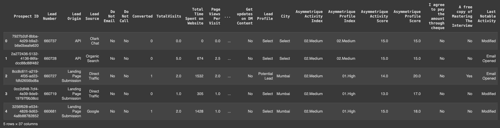

After conducting exploratory data analysis I found several columns that have many missing values. However, PyCaret will automatically handle the missing values. 

<h3>Visually exploring the relationship between time spent on the website and the activity score along with the source of lead:</h3>

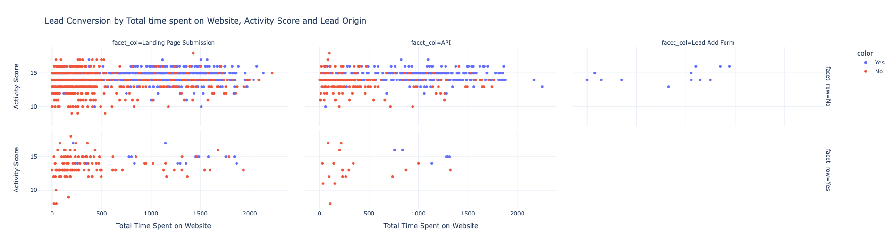

Leads coming from the “Add Forms” are likely to convert into sales irrespective of the time spent on the website or the score. The leads originating through API or the landing page of the website tell a different story. A higher score combined with a higher time spent on the website is more likely to generate leads into final sales.

<h3> Data Preparation </h3>
Initializing the setup function in PyCaret automatically profiles the dataset and infers the data types for all input variables.

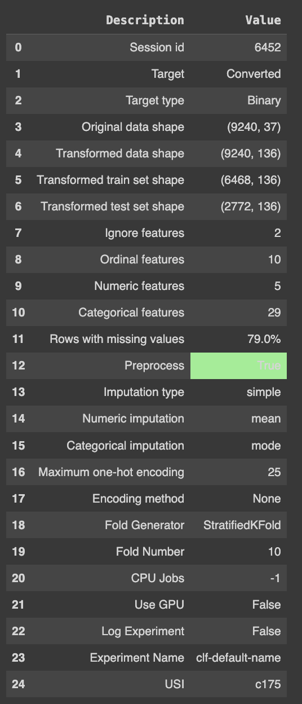

Output from setup. 
Initializing the setup function in PyCaret will automatically profile the dataset and infer the data types for all input variables.

<h3> Model Training & Selection
Training process by using compare_models functionality. This function trains all the algorithms available in the model library and evaluates multiple performance metrics using cross-validation.

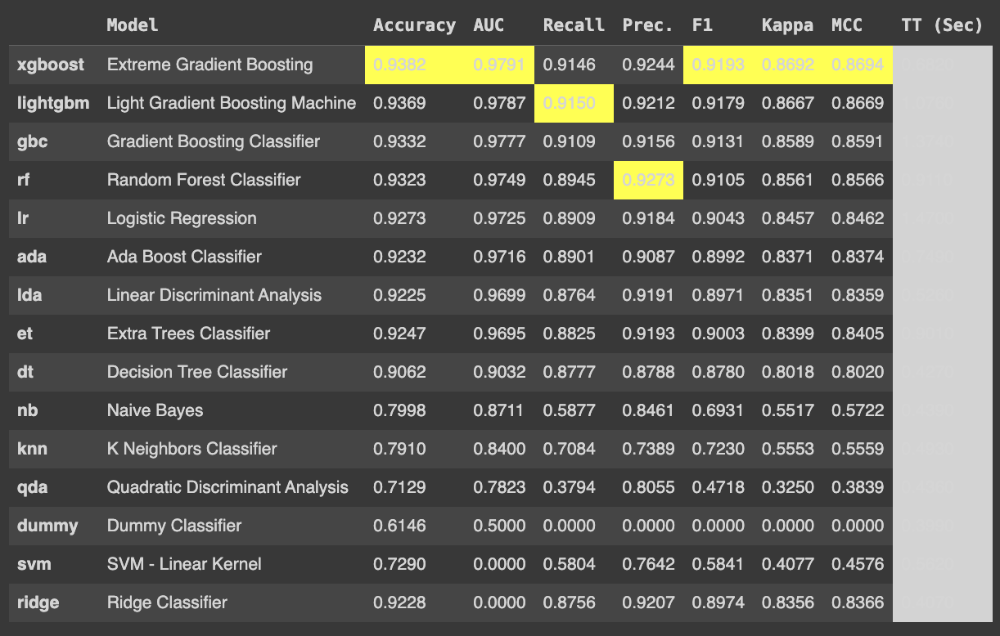

The best model based on AUC is Catboost Classifier with an average 10-fold cross-validated AUC of **0.9864**

<h3> Model Analysis </h3>
Utilizing an AUC — ROC curve as it is used as a performance measurement for the classification problems at various threshold settings. 
ROC is a probability curve and AUC represents the degree or measure of 

<ul>ROC is a probability curve and AUC represents the degree or measure of separability. </ul> 
<ul> It tells how much the model is capable of distinguishing between classes. </ul> 
<ul>The higher the AUC, the better the model is at predicting positive and negative classes.</ul> 

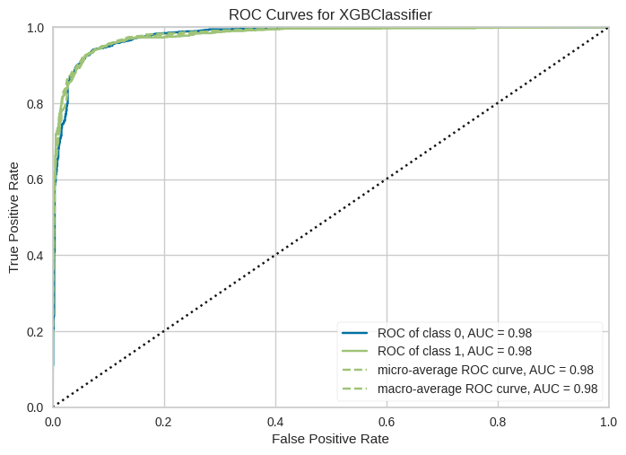

<h3>SHAP Values</h3>
Unlike AUC-ROC, SHAP values do not tell us anything about model performance. It interprets the impact of having a certain value for a given feature in comparison to the prediction made if that feature took some baseline value. 

<ul>The y-axis, in the chart below, has all the important features of the model</ul>
<ul>The x-axis is the Shapley value of associated features and the color scale (the actual value of the feature)</ul>
<ul>Each dot on the graph at each feature is a customer lead (from the test set) — overlapping each other</ul>

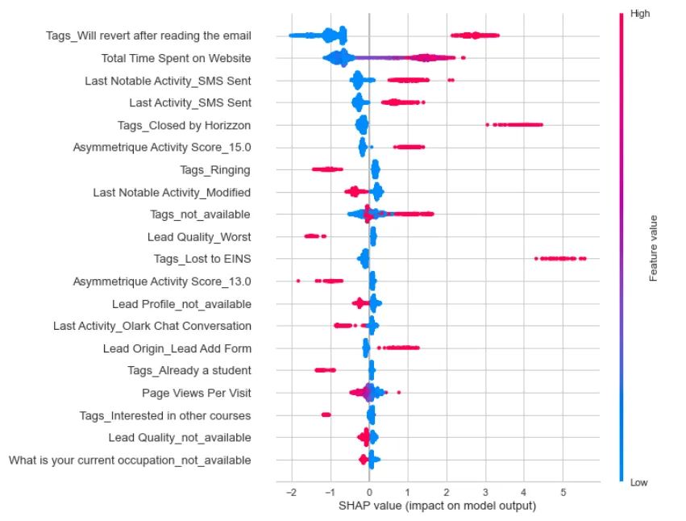

<h3> Feature Importance Plot</h3>
A feature importance plot is just another way to interpret the results of the model and tell us if the feature is important.

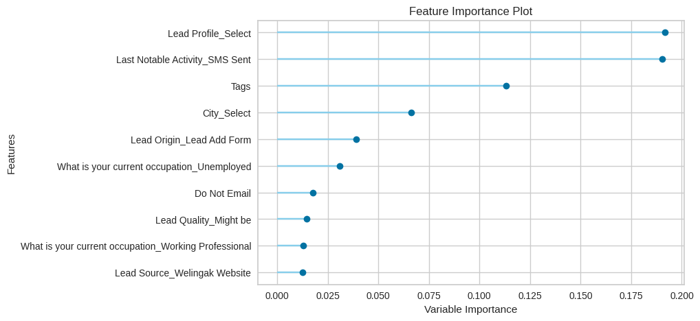

<h3>Confusion Matrix</h3>
Comparing the predictions with actual labels and divide them into four quadrants using a confusion matrix:

* True Positive (Prediction: Conversion, Actual: Conversion)
* True Negative (Prediction: No Conversion, Actual: No Conversion)
* False Positive (Prediction: Conversion, Actual: No Conversion)
* False Negative (Prediction: No Conversion, Actual: Conversion)

* 972 customers are true positives=the leads model predicted will convert and they converted
* 93 leads are false positive
* 96 leads are false negatives 
* 1611 leads are true negatives
  
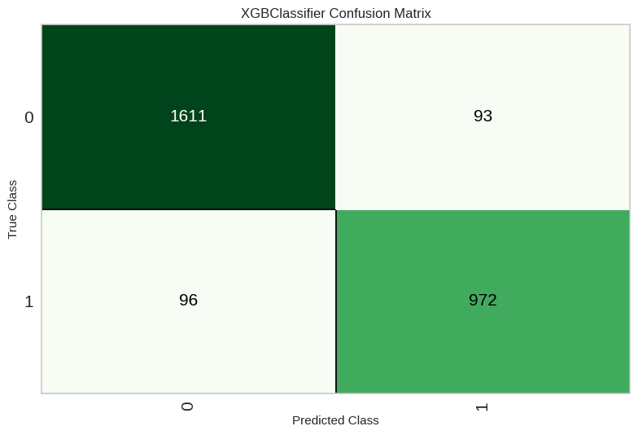

<h3> The business value of this model and why should we use this model?</h3>
To attach business value to this model the following assumptions have to be made:

* Lead converted into sales will yield $120 in Revenue for the first year
* Time and efforts spent on chasing prioritized leads (as predicted by the model) is $15
* Opportunities missed by the model (False negatives) yield negative $120 as opportunity cost

Profit = $88,830 

Haven't fed in the assumptions of cost/profit yet hence the model is not a business-smart model.

Train, select, and optimize models using business metrics in order to achieve the business goal.

<h3> Adding Custom Metric in PyCaret</h3>

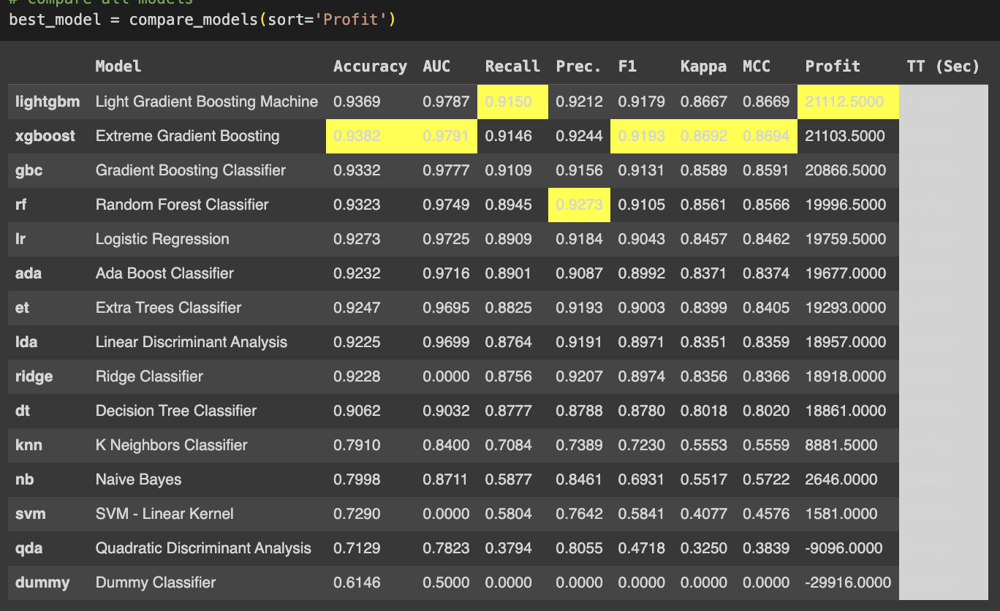

A new column Profit is added this time and Light Gradient Boosting Machine is the best model based on Profit rather than Catboost Classifier. 

The total number of customers is still the same (2,773 customers in the test set), what’s changed is now how the model is making errors over false positives and false negatives. Let’s put some $ value against it, using the same assumptions (as above):

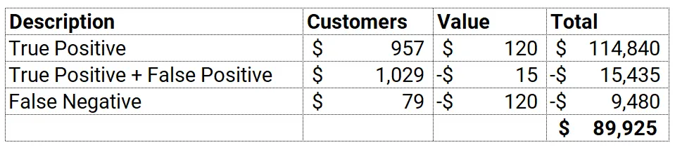

* The profit is now $89,925 compared to $88,830 when Catboost Classifier was used (1.2% increase)

<h3> Use the model to generate a lead score</h3>
Applying this model to new leads to generate the score since the best model has been selected:

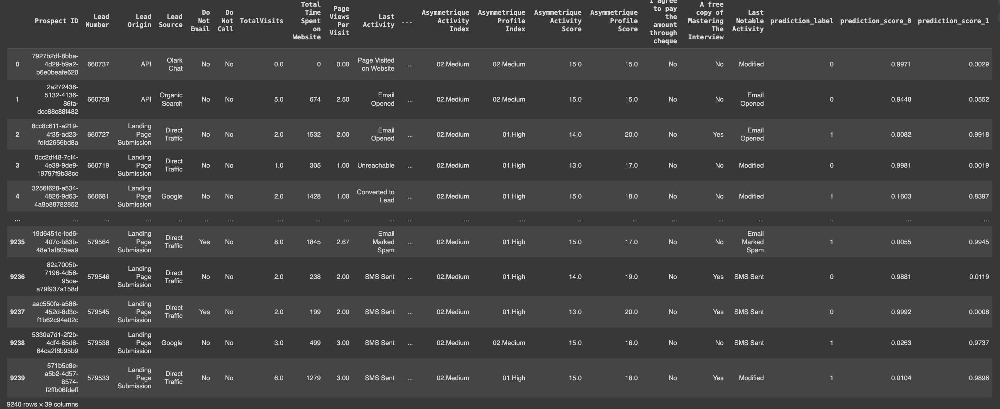

The last three columns are added to the dataset:
* Label (1 = conversion, 0 = no conversion)
* Score_0
* Score_1 

They are the probability for each class between 0 to 1. For example, the first observation Score_0 is 0.9973 meaning a 99.7% probability for no conversion.

